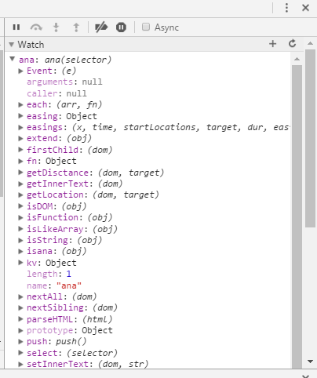
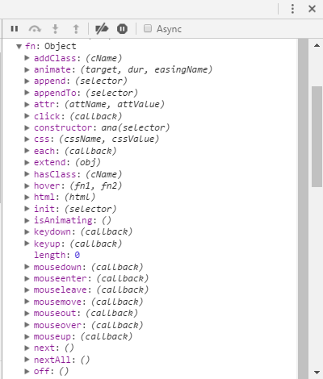

### ana.js 设计核心思想
```
(function(window, undefined) {
    var ana = function(selector) {
        return new ana.prototype.init(selector);
    };
    // 核心原型
    //ana.fn.extend 是给我们的原型添加 使得我们的对象、实例有这个成员
    //ana.extend 是给我们的函数添加 作为工具和方法
    ana.fn = ana.prototype = {
        constructor: ana,
        init: function(selector) {},
        extend: function(obj) {},
        // 功能性方法
        appendTo: function(selector) { /*....*/ }
    };
    // method
    // function
    ana.fn.init.prototype = ana.prototype;
    // var temp = ana( '' );
    // 在 jq 中, 方法的种类很多
    // 选择:  next, nextAll, find, children, ..., filter()
    // dom:	 appendTo, prependTo, after, ...
    // 属性:  attr, val, text, html, ...
    // 样式:  css, addClass, hasClass, toggleClass, ...
    // 事件:  click, on, mousedown, ...
    // 动画:  show, hide, slidDown, animate, ...
    // 队列, ajax, ...
    // 插件 ...
    // 可扩展
    ana.extend = ana.fn.extend = function(obj) {
        // 将 obj 的成员加到 this 上
        var k;
        for (k in obj) {
            this[k] = obj[k];
        }
    };
    ana.fn.xxx = xx;
    ana.fn.xxx = xx;
    ana.fn.xxx = xx;
    // 模块
    ana.fn.extend({
        xxx: xxxxxx,
        xxx: function() {}
    });
    // 提供功能性成员
    ana.extend({

    });

    window.ana = ana;
})(window);
```
### ana 挂载的属性



### 01-09 文件夹中为针对不同模块的开发设计过程

### confirm 文件夹 - 简单案例的总结
- 3D/CSS3
- Flex/Ajax

### oop - 面向对象
- 瀑布流案例
- 轮播图案例
- 三级联动案例

### review - Js 基础回顾
- 基础 + 正则表达式